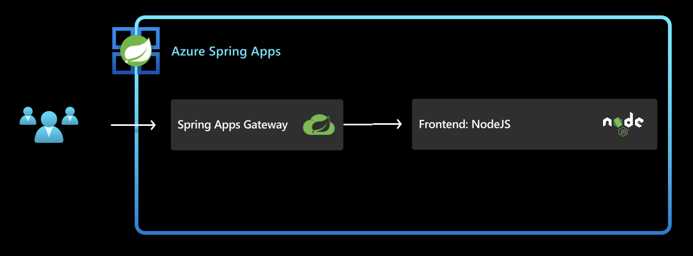
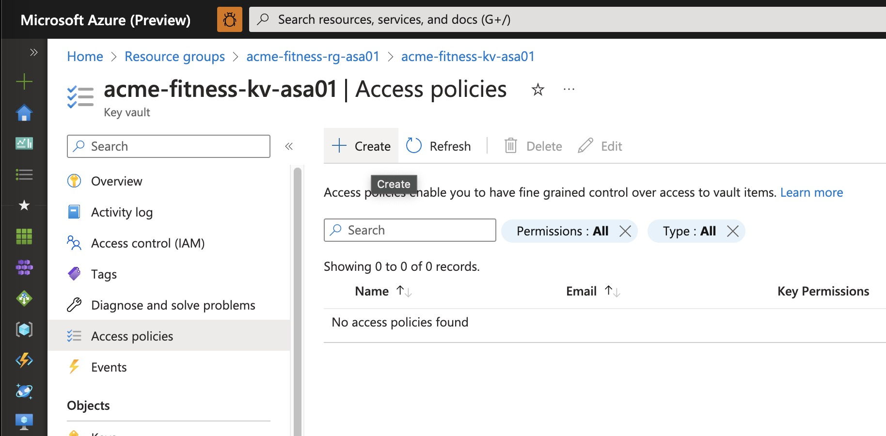
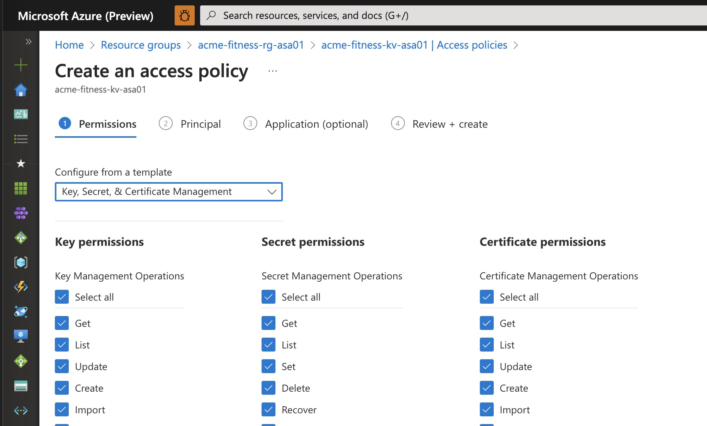
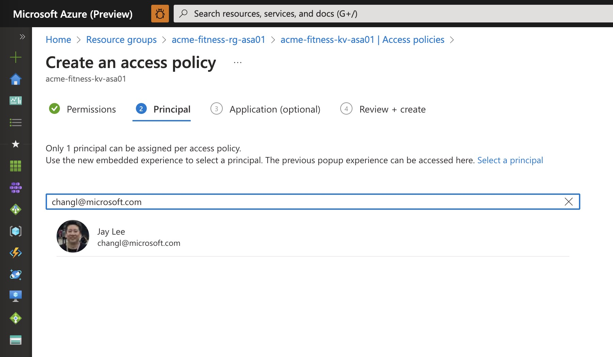
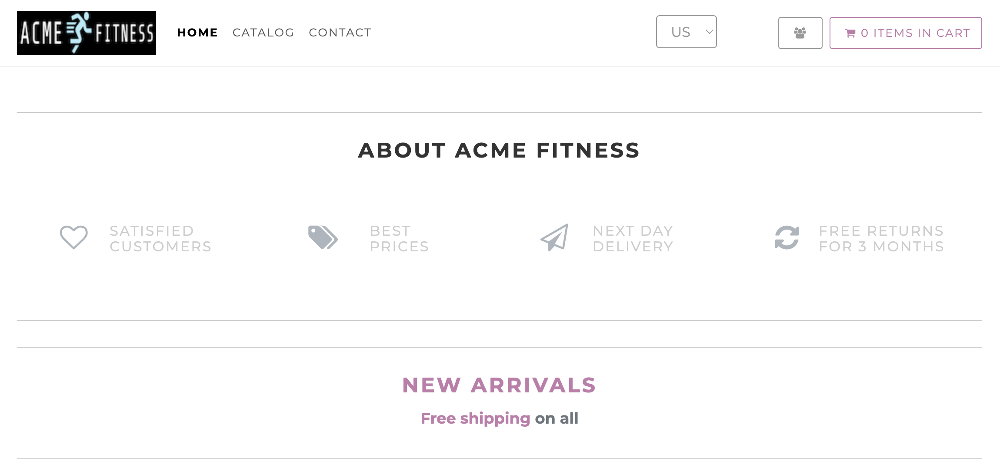
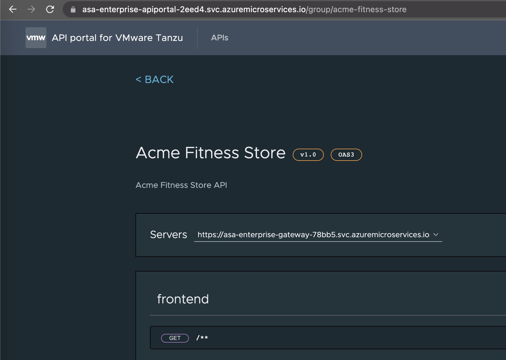

In the previous section we deployed a simple hello-world service to ASA Enterprise instance. In this section we are going to deploy the frontend of acme-fitness, configure that with Spring Cloud Gateway and validate that we are able to access the frontend. 

This diagram below shows the final result once this section is complete:


Below are the different steps that we configure/create to successfully deploy the services/apps
- [1. Configure sampling rate for Application Insights](#1-configure-sampling-rate-for-application-insights)
  - [1.1. Update Sampling Rate](#11-update-sampling-rate)
- [2. Create and Deploy frontend application in Azure Spring Apps](#2-create-and-deploy-frontend-application-in-azure-spring-apps)
- [3. Configure Spring Cloud Gateway](#3-configure-spring-cloud-gateway)
  - [3.1. Create  routing rules for the applications:](#31-create--routing-rules-for-the-applications)
- [4. Access the Application through Spring Cloud Gateway](#4-access-the-application-through-spring-cloud-gateway)
- [5. Explore the API using API Portal](#5-explore-the-api-using-api-portal)


## 1. Configure sampling rate for Application Insights

This is a preliminary step that is not related to deploying the frontend app. But this is here to make sure that Application Insights is configured with all the required information before deploying any apps. More details about Application Insights will be discussed in hol 09.

Open `./scripts/setup-keyvault-env-variables.sh` and update the following information:

```shell
export KEY_VAULT=acme-fitness-kv-asaXX
```

Then, set the environment:

```shell
source ./scripts/setup-keyvault-env-variables.sh
```

What we will do is to store the Instrumentation Key for Application Insights in Key Vault. This is a best practice to store secrets in Key Vault and then access them from the applications. First step is to create an access policy. Go to Azure Key Vault, click on Access policies and click on Create. 



Select 'Key, Secret and Certificate Management' and move on to the next tab which is Principal. 



Click on 'Select principal' and search for your email id. 



Then save it. Now retrieve the Instrumentation Key for Application Insights and add to Key Vault.

```shell
export INSTRUMENTATION_KEY=$(az monitor app-insights component show --app ${SPRING_APPS_SERVICE} --query 'connectionString' -otsv)

az keyvault secret set --vault-name ${KEY_VAULT} \
    --name "ApplicationInsights--ConnectionString" --value ${INSTRUMENTATION_KEY}
```

### 1.1. Update Sampling Rate

Before you run the below command, please make sure that there are no existing running applications. These running application causes a conflict updating the buildpacks builder. If you have existing applications, they can be deleted from Azure Portal, going to Azure Spring Apps Instance and going to Apps section. 

Increase the sampling rate for the Application Insights binding.

```shell
az spring build-service builder buildpack-binding set \
    --builder-name default \
    --name default \
    --type ApplicationInsights \
    --properties sampling-rate=100 connection-string=${INSTRUMENTATION_KEY}
```

Let Instructor know if this step fails. 

## 2. Create and Deploy frontend application in Azure Spring Apps

First step is to create an application for each service:

```shell
az spring app create --name frontend --instance-count 1 --memory 1Gi
```

Once the above step is complete, we need to deploy the app.
```shell
az spring app deploy --name frontend \
    --source-path ./apps/acme-shopping 
```

## 3. Configure Spring Cloud Gateway

Assign a public endpoint and update the Spring Cloud Gateway configuration with API
information:

```shell
az spring gateway update --assign-endpoint true

export GATEWAY_URL=$(az spring gateway show --query "properties.url" -otsv)
```
The assign-endpoint argument with a value of true creates a publicly accessible endpoint for the gateway.

```shell
az spring gateway update \
    --api-description "Acme Fitness Store API" \
    --api-title "Acme Fitness Store" \
    --api-version "v1.0" \
    --server-url "https://${GATEWAY_URL}" \
    --allowed-origins "*"
```

### 3.1. Create  routing rules for the applications:

Routing rules bind endpoints in the request to the backend applications. In the step below we are creating a rule in SCG to the frontend app.

```shell

az spring gateway route-config create \
    --name frontend \
    --app-name frontend \
    --routes-file ./routes/frontend.json

```

## 4. Access the Application through Spring Cloud Gateway

Retrieve the URL for Spring Cloud Gateway and open it in a browser:

```shell
echo "https://${GATEWAY_URL}"
```

If you see acme-fitness home page displayed as below, then congratulations. Your frontend app and its corresponding route in SCG are configured correctly and deployed successfully. Explore the application, but notice that not everything is functioning yet. Continue on to next section to configure the rest of the functionality.



## 5. Explore the API using API Portal

Assign an endpoint to API Portal and open it in a browser:

```shell
az spring api-portal update --assign-endpoint true

export PORTAL_URL=$(az spring api-portal show --query "properties.url" -otsv)

echo "https://${PORTAL_URL}"
```
Open the browser and navigate to the PORTAL_URL. You should see the API Portal as below.


➡️ Previous guide: [02 - Deploy Simple Hello World spring boot app](../02-hol-1-hello-world-app/README.md)

➡️ Next guide: [04 - Hands On Lab 3.1 - Deploy backend apps](../04-hol-3.1-deploy-backend-apps/README.md)