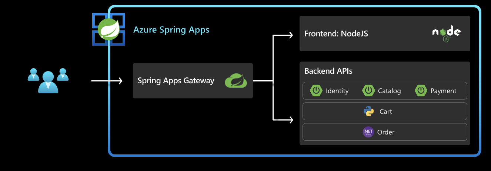
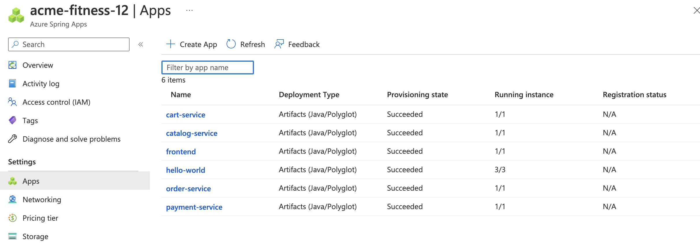
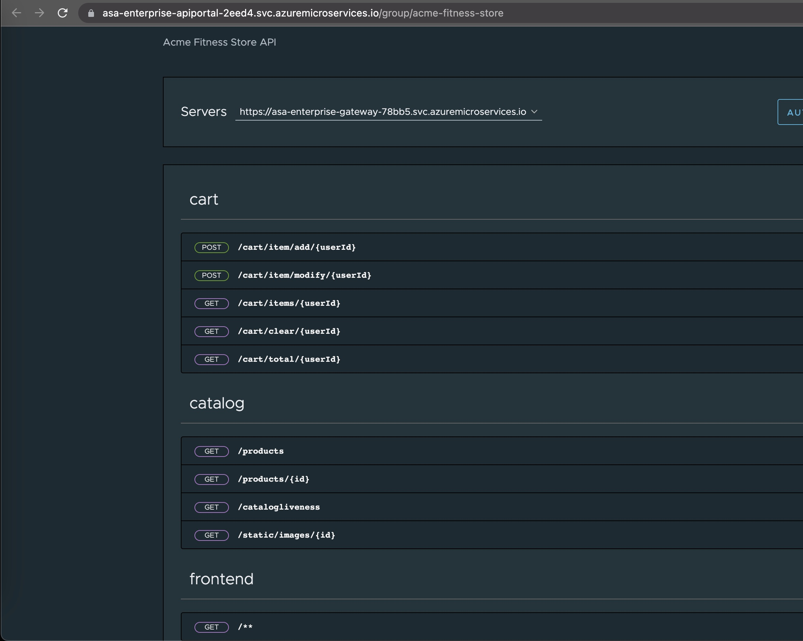

In this section we are going to deploy the backend apps for acme-fitness application. We also update the rules for these backend apps in Spring Cloud Gateway.

This diagram below shows the final result once this section is complete:


Below are the different steps that we configure/create to successfully deploy the services/apps
- [1. Create backend apps](#1-create-backend-apps)
- [2. Deploy backend apps](#2-deploy-backend-apps)
- [3. Create  routing rules for the backend apps:](#3-create--routing-rules-for-the-backend-apps)


## 1. Create backend apps

First step is to create an application for each service:

```shell
az spring app create --name cart-service --instance-count 1 --memory 1Gi

az spring app create --name order-service --instance-count 1 --memory 1Gi

az spring app create --name payment-service --instance-count 1 --memory 1Gi

az spring app create --name catalog-service --instance-count 1 --memory 1Gi
```
If the above step is successfully complete, you should see all the backend apps listed in your ASA-E instance as below..



## 2. Deploy backend apps

Now that all the required apps are created, the next step is to go ahead and deploy the services/apps. For this we need access to the source code for the services. 

```shell
# Deploy Payment Service
az spring app deploy --name payment-service \
    --config-file-pattern payment/default \
    --build-env BP_JVM_VERSION=17 \
    --source-path ./apps/acme-payment

# Deploy Catalog Service
az spring app deploy --name catalog-service \
    --config-file-pattern catalog/default \
    --build-env BP_JVM_VERSION=17 \
    --source-path ./apps/acme-catalog 

# Deploy Order Service
az spring app deploy --name order-service \
    --source-path ./apps/acme-order 

# Deploy Cart Service 
az spring app deploy --name cart-service \
    --env "CART_PORT=8080" \
    --source-path ./apps/acme-cart 
```

So far in this section we were able to successfully create and deploy the apps into an existing azure spring apps instance. 

## 3. Create  routing rules for the backend apps:

Routing rules bind endpoints in the request to the backend applications. For example in the Cart route below, the routing rule indicates any requests to /cart/** endpoint gets routed to backend Cart App.

```shell
az spring gateway route-config create \
    --name cart-service \
    --app-name cart-service \
    --routes-file ./routes/cart-service.json
    
az spring gateway route-config create \
    --name order-service \
    --app-name order-service \
    --routes-file ./routes/order-service.json

az spring gateway route-config create \
    --name catalog-service \
    --app-name catalog-service \
    --routes-file ./routes/catalog-service.json

```

This completes successful deployments of all the backend apps and updating the rules for these apps in SCG.

```shell
echo "https://${PORTAL_URL}"
```



⬅️ Previous guide: [03 - Hands On Lab 2 - Deploy Frontend app](../03-hol-2-deploy-frontend-app/README.md)

➡️ Next guide: [05 - Hands On Lab 3.2 - Bind Apps to ACS and Service Registry](../05-hol-3.2-bind-apps-to-acs-service-reg/README.md)